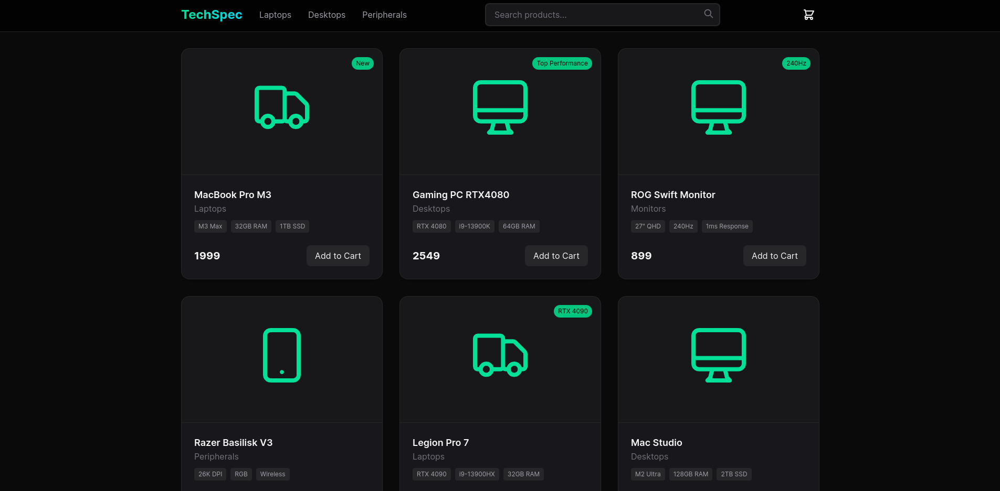

# TechSpec - Modern Tech Store Demo 🚀

A modern, responsive e-commerce layout built with Angular and TailwindCSS. This project is a demo/mockup showcasing modern design patterns and UI interactions.

## ✨ Demo

[Live Demo](https://fijolkrzysztof.github.io/tech-shop/)



## 🌟 Features

- **Modern Design**
  - Responsive layout for all devices
  - Smooth animations and transitions
  - Modern card-based product display

- **UI Components**
  - Product search functionality
  - Interactive shopping cart
  - Product cards with specs
  - Responsive navigation
  - Animated interactions

- **Technical Stack**
  - Standalone Angular components
  - TailwindCSS for styling
  - Custom SVG icons
  - TypeScript
  - RxJS for state demo

## 🛠️ Technologies Used

- Angular 18
- TypeScript 5
- TailwindCSS 3
- Node.js 20
- NPM 10

## 📋 Prerequisites

- Node.js (version 20 or higher)
- NPM (version 10 or higher)
- Angular CLI (version 18)

## 🚀 Installation

1. Clone the repository
```bash
git clone https://github.com/fijolkrzysztof/tech-shop.git
cd tech-shop
```

2. Install dependencies
```bash
npm install
```

3. Start the development server
```bash
ng serve
```

4. Open your browser and navigate to `http://localhost:4200`

## 📱 Responsive Design

The layout is fully responsive and optimized for:
- Desktop screens (1200px+)
- Tablets (768px - 1199px)
- Mobile devices (<768px)

## 📝 License

This project is licensed under the MIT License.
